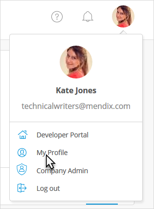
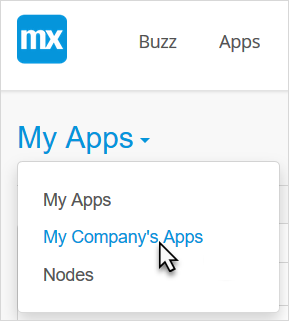
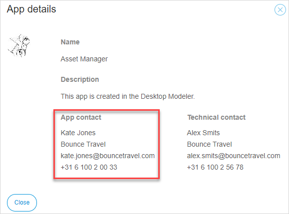
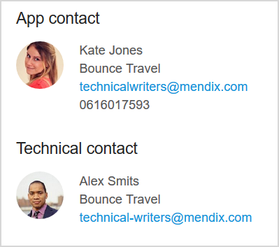
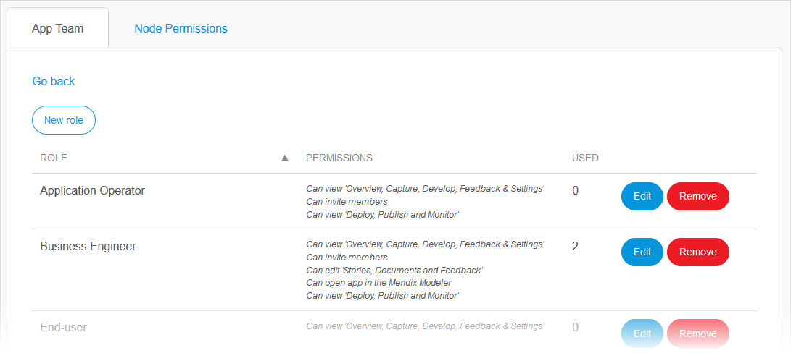

## 1 Introduction

In order to use Mendix, you must sign up to create an account. With this signup you create a MxID, and this ID will be linked to a company. If the company already exists, you will join the company. If it is a new company, a new company will be created and you will automatically join it.

The roles defined within a company, app, and App Team are described below.

## 2 Company Roles

Everyone with the same email domain will be automatically placed in the same company. For example, all the users that sign up with an email address with the `@bouncetravel.com` email domain will automatically join the company named *Bounce Travel*.

Within the company there are three roles, which are described below.

### 2.1 Company Admin

The Company Admin is a regular user with additional privileges. The Company Admin role is a "super role" allowed to manage all the settings of the company, including the settings of the company's apps, cloud nodes, and users. A company can have multiple Company Admins, but regular users cannot see who has the Company Admin role.

 

For details on this role, see [Company Admin Overview](companyadmin-overview).

### 2.2 Company Contact

Because a company can have multiple Company Admins and regular users cannot see who has the the Company Admin role, making one of the Company Admins the Company Contact is recommended. The Company Contact is visible to regular users. In addition, if they also have the Company Admin role, the Company Contact can perform company operations on behalf of all Company Admins.

To view the Company Contact, follow these steps:

1. Go to the [Developer Portal](http://home.mendix.com).
2. In the top-right corner, click your avatar and then select **My Profile**:

    

3. Below your name, click your the name of your company.
4. Below **Contact**, you can see the Company Contact:

    

A Company Admin can change the Company Contact on their Company Admin [Company](company) page.

### 2.3 Regular Users

Regular users are all company members. Regular users can join the company, start building apps, and view other apps made within the company. 

By selecting **My Company's Apps** in the [Developer Portal](http://home.mendix.com), a regular user can view details about the apps made in their company.

As a regular user, you cannot join an App Team by yourself. If you want to join an App Team, you have to ask a current App Team member (with an *invite* permission) of the app to send an invitation. Because Team Members are not visible, you can ask the App Contact to send the invite:

Accordingly, it is important that the App Contact has the correct permissions to manage the app (for example, the SCRUM Master role).

For more information on roles and permissions, see [App Team Roles](#app-team-roles) below. 

## 3 App Roles

When you view the details for a specific app, you will see the two roles responsible for the app: **App Contact** and **Technical Contacts**. You can contact them with questions related to the app.

The app roles are described below.

### 3.1 App Contact

The App Contact is visible to regular users and is the go-to person for questions related to the app. If you build your own app, you will automatically become the App Contact and you will have a SCRUM Master role within the [App Team roles](#app-team-roles). 

If the App Contact changes (which can be done on the [General Settings](../settings/general-settings) page for your app), providing the new App Contact with the App Team [SCRUM Master](#scrum-master) role is recommended. The App Contact will be the contact person for regular users and will be able to perform app operations on behalf of all SCRUM Masters.

### 3.2 Technical Contact {#technical-contact}

The Technical Contact manages the technical deployment settings of the app. The Technical Contact can be responsible for different deployment platforms (for example, a Mendix Cloud node, on-premises, other platforms such as SAP). For details on cloud deployment, see [Deploy](../deploy).

With an app hosted in the Mendix Cloud, the Technical Contact is the first contact for App Team members regarding node permissions and operations. 

Only the Technical Contact is allowed to do the following:

* Manage users with node permissions
* Make adjustments to environments (for example, resize, add new environments) 
* Manage licenses (for example, manage renewals, activations, upgrades) 
* Configure alert settings

For more information, see [Technical Contact](/developerportal/general/technical-contact).

## 4 App Team Roles {#app-team-roles}

Within an App Team, there are six predefined roles that can be provisioned to App Team members. Company Admins can also edit and create new team roles within the company.

Each App Team role has access to permission areas based on the following factors:

* Who can edit the backlog and current [sprint](../collaborate/stories)
* Who can edit the app [model](../develop/model)
* Who has access to [cloud node](../settings/node-permissions) information (note that node permissions must be provisioned by the [Technical Contact](#technical-contact))
* Who can change the app's [general settings](../settings/general-settings)

### 4.1 Predefined App Team Roles {#scrum-master}

These are the predefined App Team roles:

Role | Explanation
------------ | -------------
Application Operator | An App Team member who does not actively develop the app, but is responsible for operations on the app's cloud node. 
Business Engineer | An App Team member who contributes to the development of the app. 
End-user | A user of the app who should have insight into the backlog but does not actively participate in development (for example, a stakeholder). 
Product Owner | The product owner of the Scrum team who is responsible for managing the app's backlog.
SCRUM Master | The Scrum Master of the Agile App Team. In addition to contributing to development, the SCRUM Master manages all the settings within the app. If you create a new app, you will automatically become the SCRUM Master. 

### 4.2 Editing App Team Roles

The predefined roles can be changed in two locations:

* As a [Company Admin](companyadmin-overview), click **Role settings** on the [Roles Tab](apps#roles-tab) of your Company Admin's **Apps** page to edit the roles (the changes will affect every app created after the change)

	

* As a [SCRUM Master](#scrum-master), you can edit roles for the specific app of which you are the SCRUM Master by selecting **Team** > **Manage Team** and clicking **Role settings**

	

## 5 Related Content

* [Mendix Profile](mendix-profile)
* [Company Admin Overview](/developerportal/general/companyadmin-overview)
* [How to Manage Company Roles and App Roles](/developerportal/howto/change-roles)
* [Settings](/developerportal/settings)
* [Technical Contact](technical-contact)
